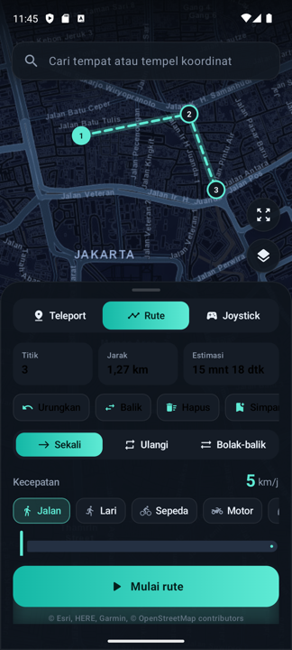

  

  
  
  
  

**Mock Location** adalah aplikasi Android untuk memalsukan lokasi GPS perangkat, **tanpa root**. Pilih satu titik lalu teleport, jalankan rute otomatis antar waypoint dengan kecepatan realistis, atau kendalikan arah langsung pakai joystick. Joystick-nya bahkan bisa melayang di atas aplikasi lain.

  
  
  
  

## ✨ Fitur

| | Fitur | Keterangan |
|---|---|---|
| 📍 | **Teleport** | Ketuk peta, cari tempat, atau tempel koordinat. Lalu pindah instan. Simpan sebagai favorit. |
| 🛣️ | **Rute** | Susun waypoint di peta, seret untuk memindah, ketuk untuk menghapus. Bisa jalan **sekali**, **ulangi**, atau **bolak-balik**. |
| 🎮 | **Joystick** | Kendalikan arah dan kecepatan secara manual. Ada **joystick melayang** untuk dipakai di dalam game/aplikasi lain. |
| 🚶 | **Kecepatan realistis** | Preset Jalan, Lari, Sepeda, Motor, Mobil, atau slider 1–150 km/j. Bisa diubah saat sedang berjalan. |
| ✨ | **Gerak natural** | Variasi kecepatan dan akurasi seperti sinyal GPS asli, bukan garis lurus sempurna. |
| 📂 | **GPX** | Impor rute dari file `.gpx` (Strava, Komoot, dll.) dan ekspor rute buatan sendiri. |
| 🔎 | **Pencarian** | Cari tempat via OpenStreetMap/Nominatim atau tempel koordinat `-6.1754, 106.8272`. |
| 🗺️ | **3 gaya peta** | Gelap, Jalan, dan Satelit. Tanpa API key. |
| 🔔 | **Notifikasi kontrol** | Jeda, lanjut, dan stop langsung dari notifikasi. |
| 🧭 | **Setup terpandu** | Checklist izin dan Opsi Developer dengan tombol pintas. |

## 📥 Instalasi

1. Unduh `MockLocation-v2.0.apk` dari halaman [**Releases**](../../releases/latest), lalu install. Izinkan *Install dari sumber tidak dikenal* bila diminta.
2. Buka aplikasi, lalu izinkan **lokasi** dan **notifikasi**.
3. Aktifkan **Opsi developer**: *Setelan → Tentang ponsel → ketuk Nomor build 7×*.
4. Buka *Opsi developer → Pilih aplikasi lokasi palsu → **Mock Location***.

Selesai. Panduan lengkap per mode, tips, dan pemecahan masalah ada di [**Panduan Pengguna**](docs/PANDUAN.md).

## 📚 Dokumentasi

| Dokumen | Isi |
|---|---|
| [Panduan Pengguna](docs/PANDUAN.md) | Setup, cara pakai tiap mode, GPX, tips per merek HP, FAQ |
| [Arsitektur](docs/ARSITEKTUR.md) | Cara kerja mock location, komponen, alur data |
| [Pengembangan](docs/PENGEMBANGAN.md) | Build dari source, test, signing, cara merilis |
| [Changelog](CHANGELOG.md) | Riwayat versi |

## ⚠️ Penggunaan yang bertanggung jawab

Aplikasi ini ditujukan untuk **pengujian aplikasi berbasis lokasi, demo, dan privasi**. Android menandai setiap lokasi dari aplikasi ini sebagai *mock*, sehingga banyak aplikasi (perbankan, ojek online, sebagian game) bisa mendeteksinya lalu menolak akses atau menangguhkan akun. Memalsukan lokasi untuk menipu layanan, absensi, atau transaksi bisa melanggar ketentuan layanan maupun hukum. Segala risiko penggunaan ditanggung pengguna.

## 🙏 Atribusi

Peta © [Esri](https://www.esri.com), HERE, Garmin, © [OpenStreetMap contributors](https://www.openstreetmap.org/copyright). Pencarian oleh [Nominatim](https://nominatim.org). Rendering peta memakai [osmdroid](https://github.com/osmdroid/osmdroid).
