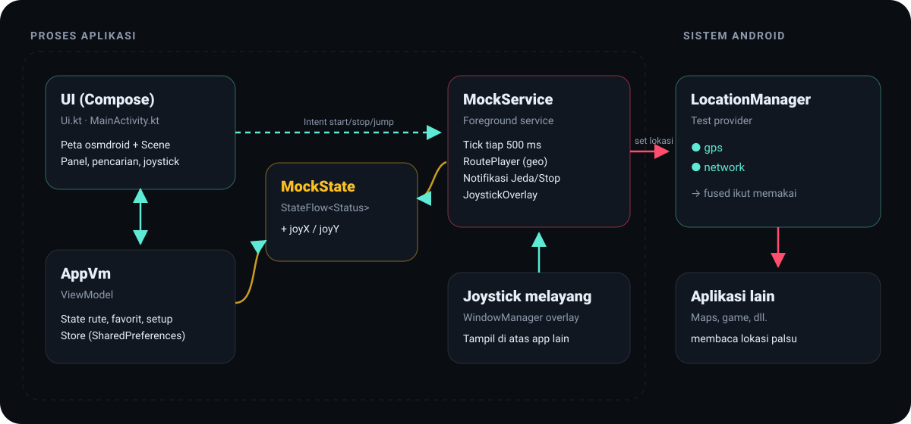

# 🧩 Arsitektur

<p align="center"></p>

## Cara kerja mock location di Android

Android menyediakan **test provider** di `LocationManager` agar developer bisa menguji aplikasi berbasis lokasi. Aplikasi yang dipilih pada *Opsi developer → Pilih aplikasi lokasi palsu* diberi izin (app-op `MOCK_LOCATION`) untuk:

```kotlin
lm.addTestProvider(GPS_PROVIDER, …)          // daftarkan provider palsu
lm.setTestProviderEnabled(GPS_PROVIDER, true)
lm.setTestProviderLocation(GPS_PROVIDER, loc) // kirim lokasi, berulang
```

Selama test provider terdaftar, semua aplikasi yang meminta lokasi dari provider tersebut menerima lokasi palsu. Karena itu **tidak perlu root**.

Aplikasi ini mendaftarkan dua provider:

| Provider | Alasan |
|---|---|
| `gps` | Wajib. Sumber utama untuk aplikasi yang meminta GPS. |
| `network` | *Best effort*. Tanpa ini, **Fused Location Provider** (dipakai Google Maps & kebanyakan aplikasi) bisa mencampur lokasi asli dari Wi-Fi/BTS. |

Setiap lokasi diisi lengkap (`accuracy`, `speed`, `bearing`, `elapsedRealtimeNanos`, `verticalAccuracyMeters`, dll.). Lokasi yang tidak lengkap akan ditolak sistem.

## Komponen

| File | Tanggung jawab |
|---|---|
| `MainActivity.kt` | `MainActivity` (edge-to-edge, konfigurasi osmdroid) dan `AppVm`: state UI, pencarian Nominatim, GPX, pemeriksaan setup (izin, app-op mock, overlay). |
| `Ui.kt` | Seluruh UI Jetpack Compose: tema, peta, pencarian, panel kontrol, joystick, checklist setup, dialog. |
| `MapScene.kt` | Overlay osmdroid kustom: menggambar rute, jejak, target, dan **posisi live yang diinterpolasi**. Menangani ketuk dan seret waypoint. Sumber ubin peta. |
| `MockService.kt` | *Foreground service* bertipe `location`. Loop tiap 500 ms: hitung posisi → kirim ke test provider → publikasikan `Status`. Juga notifikasi Jeda/Stop. |
| `JoystickOverlay.kt` | Joystick berbasis `View` yang ditempel ke `WindowManager` (`TYPE_APPLICATION_OVERLAY`) agar tampil di atas aplikasi lain. |
| `RoutePlayer.kt` | Logika murni tanpa Android: haversine, bearing, `move`, posisi sepanjang rute untuk tiap pola putaran, parser/penulis GPX, format jarak/waktu. **Seluruhnya di-unit-test.** |
| `Store.kt` | Persistensi kecil berbasis `SharedPreferences` + JSON: pengaturan, draf rute, favorit, rute tersimpan, posisi kamera. |

## Alur data

```
 UI ──Intent(start/stop/jump/speed)──▶ MockService ──setTestProviderLocation──▶ LocationManager ──▶ aplikasi lain
  ▲                                        │
  └──────── MockState.status (StateFlow) ◀─┘
 Joystick (Compose / overlay) ──▶ MockState.joyX/joyY ──▶ dibaca MockService tiap tick
```

- **UI → Service** memakai `Intent` biasa, sehingga service bisa dikontrol juga dari notifikasi.
- **Service → UI** memakai `MockState.status`, sebuah `StateFlow` global. Service dan UI berada di proses yang sama, jadi tidak perlu binder atau IPC.
- **Joystick** menulis vektor arah (`joyX`, `joyY` dalam rentang −1…1) ke `MockState`. Service membacanya di tick berikutnya, lalu menghitung `bearing = atan2(x, −y)` dan `jarak = kecepatan × |vektor| × Δt`.

## Keputusan desain

| Keputusan | Alasan |
|---|---|
| **Posisi rute berbasis jarak tempuh**, bukan waktu | Jeda, lanjut, dan ganti kecepatan di tengah jalan tetap akurat. Service hanya menambah `traveled += v·Δt`. |
| **Pola putaran dihitung murni** (`RoutePlayer.along`) | Loop = rute + titik awal, lalu modulo panjang. Bolak-balik = modulo 2× panjang lalu balik arah. Mudah dites. |
| **Interpolasi di overlay** | Service mengirim posisi tiap 500 ms, tapi marker digambar ulang tiap frame dengan interpolasi linear (termasuk sudut terpendek untuk bearing). Hasilnya gerakan mulus 60 fps tanpa membebani sistem lokasi. |
| **Ubin peta Esri tanpa key** | `tile.openstreetmap.org` memblokir aplikasi pihak ketiga, dan CARTO kini butuh API key. Gaya "Gelap" memakai ubin jalan Esri yang diberi `ColorMatrix` (desaturasi, inversi, tint navy). |
| **Nominatim hanya saat submit** | Mengikuti kebijakan penggunaan Nominatim: maksimal 1 permintaan/detik, tanpa autocomplete, dengan User-Agent yang jelas. |
| **Parser GPX menolak DOCTYPE** | File berasal dari pengguna, jadi fitur DTD dimatikan untuk mencegah XXE. |
| **Pemeriksaan app-op `MOCK_LOCATION`** sebelum mulai | Memberi petunjuk yang jelas alih-alih gagal diam-diam. Service tetap menangkap `SecurityException` sebagai lapisan kedua. |

## Batasan yang diketahui

- Lokasi selalu bertanda `isMock = true`. Aplikasi ini tidak berusaha menyembunyikannya.
- Rute melintasi garis bujur ±180° tidak diinterpolasi dengan benar (interpolasi lat/lon linear per segmen).
- Ketinggian (altitude) tetap 12 m.
- Ubin satelit Esri punya zoom maksimal 19.
