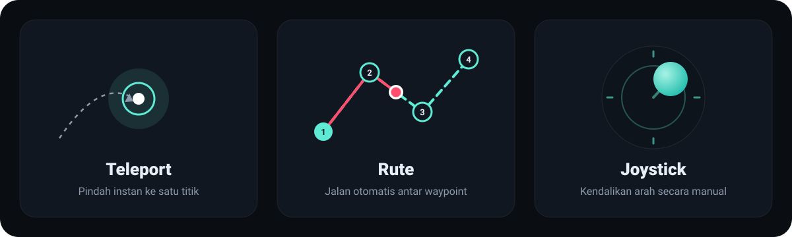
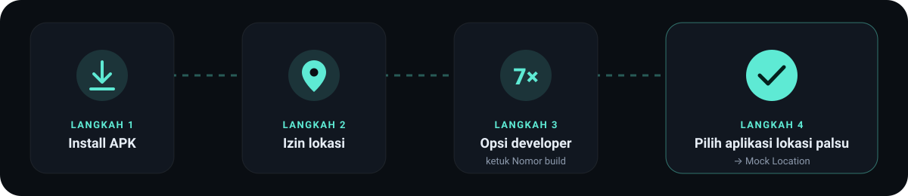
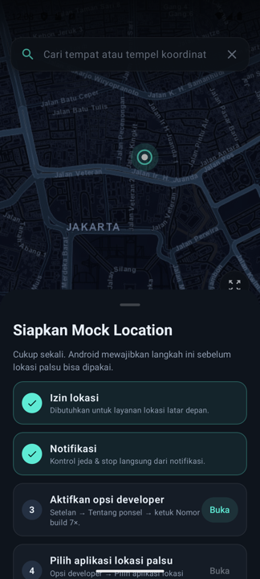
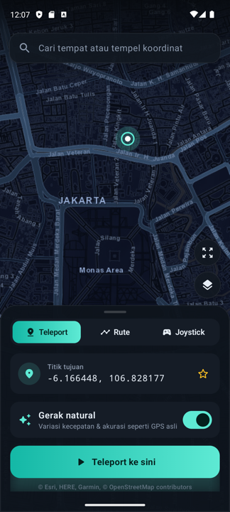
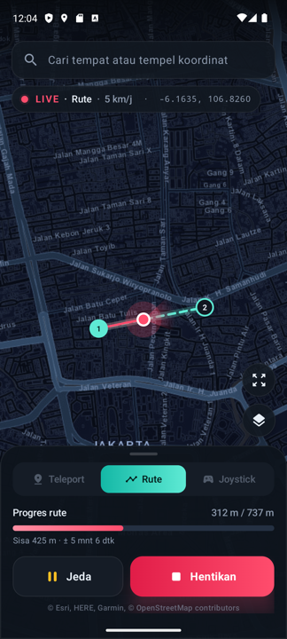
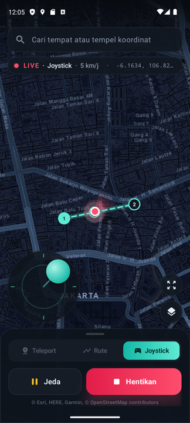
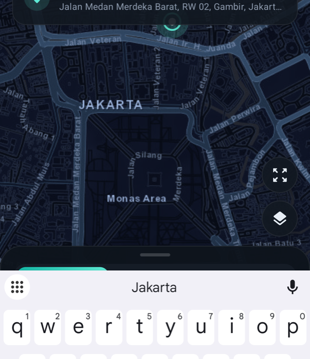

# 📖 Panduan Pengguna

<p align="center"></p>

- [1. Persiapan (sekali saja)](#1-persiapan-sekali-saja)
- [2. Mengenal layar utama](#2-mengenal-layar-utama)
- [3. Mode Teleport](#3-mode-teleport)
- [4. Mode Rute](#4-mode-rute)
- [5. Mode Joystick](#5-mode-joystick)
- [6. Kecepatan & gerak natural](#6-kecepatan--gerak-natural)
- [7. Pencarian & favorit](#7-pencarian--favorit)
- [8. Impor / ekspor GPX](#8-impor--ekspor-gpx)
- [9. Tips per merek HP](#9-tips-per-merek-hp)
- [10. Pemecahan masalah (FAQ)](#10-pemecahan-masalah-faq)

---

## 1. Persiapan (sekali saja)

<p align="center"></p>

Saat pertama dibuka, aplikasi menampilkan **checklist setup**. Setiap langkah punya tombol pintas dan otomatis tercentang ✓ begitu selesai.

<table><tr>
<td width="40%"></td>
<td>

| # | Langkah | Cara |
|---|---|---|
| 1 | **Izin lokasi** | Ketuk *Izinkan* → pilih *Saat aplikasi digunakan*. Wajib untuk layanan lokasi latar depan. |
| 2 | **Notifikasi** (Android 13+) | Ketuk *Izinkan*. Kontrol Jeda/Stop muncul di notifikasi. |
| 3 | **Opsi developer** | *Setelan → Tentang ponsel →* ketuk **Nomor build** 7 kali sampai muncul "Anda sekarang developer". |
| 4 | **Aplikasi lokasi palsu** | *Setelan → Sistem → Opsi developer → Pilih aplikasi lokasi palsu →* **Mock Location**. |
| 5 | **Tampil di atas aplikasi lain** *(opsional)* | Hanya untuk joystick melayang. |

</td></tr></table>

> 💡 Letak menu bisa berbeda per merek. Di Xiaomi, *Nomor build* ada di *Tentang ponsel → Versi MIUI/HyperOS*. Di Samsung ada di *Tentang ponsel → Informasi perangkat lunak*.

Checklist bisa dibuka lagi kapan saja. Kalau ada langkah wajib yang belum selesai saat kamu menekan **Mulai**, checklist muncul otomatis.

## 2. Mengenal layar utama

```
┌───────────────────────────────┐
│ 🔍 Cari tempat / koordinat     │ ← pencarian
│ ● LIVE · Rute · 5 km/j · -6.1… │ ← status (saat aktif)
│                                │
│            PETA          [⤢]   │ ← tampilkan semua
│                          [☰]   │ ← gaya peta
│  [🕹]                    [◎]   │ ← joystick / ikuti posisi
├───────────────────────────────┤
│ Teleport │  Rute  │ Joystick  │ ← pilih mode
│ … pengaturan mode …            │
│ [        ▶ Mulai rute        ] │
└───────────────────────────────┘
```

- **Panel bawah** bisa diciutkan dengan mengetuk garis kecil di atasnya. Saat mock aktif, panel otomatis menciut supaya peta lebih lega.
- **Titik merah berdenyut** adalah posisi palsu saat ini, lengkap dengan kerucut arah hadap. Garis merah di belakangnya adalah jejak yang sudah dilalui.
- Menggeser peta mematikan *ikuti posisi*. Ketuk tombol **◎** untuk mengaktifkannya lagi.

## 3. Mode Teleport



Pindah instan ke satu titik lalu diam di sana.

1. Pilih tab **Teleport**.
2. Tentukan tujuan dengan salah satu cara:
   - ketuk peta,
   - cari nama tempat, atau
   - tempel koordinat, misalnya `-6.175392, 106.827153` (format salinan Google Maps).
3. Tekan **Teleport ke sini**.

Saat teleport aktif, ketuk titik lain di peta untuk **langsung pindah** tanpa perlu stop dulu.

- Ketuk koordinat di kartu *Titik tujuan* untuk **menyalin** koordinat.
- Ketuk ☆ untuk menyimpan titik sebagai **favorit**.

<br clear="right">

## 4. Mode Rute



Berjalan otomatis melewati titik-titik secara berurutan.

**Menyusun rute:**

| Aksi | Hasil |
|---|---|
| Ketuk peta | Tambah titik baru |
| Seret titik | Pindahkan titik |
| Ketuk titik | Hapus titik |
| **Urungkan** | Hapus titik terakhir |
| **Balik** | Membalik urutan rute |
| **Hapus** | Kosongkan rute |
| **Simpan / Rute tersimpan** | Simpan dan muat rute berdasarkan nama |

Kartu statistik menampilkan **jumlah titik**, **total jarak**, dan **estimasi waktu** sesuai kecepatan.

**Pola putaran:**

- **Sekali**: berhenti di titik terakhir.
- **Ulangi**: kembali ke titik 1 lalu mengulang terus (cocok untuk rute melingkar).
- **Bolak-balik**: 1 → terakhir → 1 → …

Saat berjalan, panel menampilkan **progres**, **sisa jarak**, dan **ETA**. Tekan **Jeda** untuk berhenti sementara di posisi sekarang.

<br clear="right">

## 5. Mode Joystick



Kendalikan arah gerak sendiri.

1. Pilih tab **Joystick**. Ketuk peta untuk menentukan titik awal (kalau dilewati, dipakai titik tengah peta).
2. Atur kecepatan, lalu tekan **Mulai joystick**.
3. Joystick muncul di kiri bawah. Tahan lalu geser ke arah tujuan. Makin jauh digeser, makin cepat jalannya (sampai kecepatan maksimal yang dipilih). Lepas untuk berhenti.

**Joystick melayang:** aktifkan *Joystick melayang* sebelum mulai. Joystick akan tampil **di atas aplikasi lain**, jadi bisa dipakai sambil membuka game atau Maps.

- **⠿** untuk menggeser posisi joystick di layar.
- **Label kecepatan** diketuk untuk berganti preset (Jalan → Lari → Sepeda → Motor → Mobil).
- **✕** untuk menghentikan mock.

<br clear="right">

## 6. Kecepatan & gerak natural

| Preset | Kecepatan |
|---|---|
| 🚶 Jalan | 5 km/j |
| 🏃 Lari | 11 km/j |
| 🚲 Sepeda | 20 km/j |
| 🛵 Motor | 45 km/j |
| 🚗 Mobil | 70 km/j |

Slider bisa diatur dari 1 sampai 150 km/j. Perubahan kecepatan **langsung berlaku** walau mock sedang berjalan.

**Gerak natural** (aktif secara default) membuat lokasi lebih mirip GPS asli:

- kecepatan naik-turun halus ±15%,
- posisi bergeser acak sekitar 1 meter,
- akurasi berubah-ubah antara 3–8 meter.

Matikan kalau kamu butuh jalur yang presisi, misalnya untuk pengujian otomatis.

## 7. Pencarian & favorit



- Ketik nama tempat lalu tekan 🔍 di keyboard. Pencarian memakai OpenStreetMap (Nominatim), jadi hasilnya muncul setelah kamu menekan cari, bukan saat mengetik.
- Menempel koordinat langsung memunculkan opsi **Pergi ke koordinat**.
- Hasil yang dipilih akan:
  - di mode Teleport/Joystick: menjadi titik tujuan/awal,
  - di mode Rute: ditambahkan sebagai waypoint.
- Saat kolom pencarian kosong dan aktif, **favorit** ditampilkan.
- **Tahan** chip favorit di mode Teleport untuk menghapusnya.

<br clear="right">

## 8. Impor / ekspor GPX

- **Impor GPX**: pilih file `.gpx`. Aplikasi membaca *track point*, lalu *route point*, lalu *waypoint* (mana yang pertama ada). Rute besar ribuan titik didukung; di peta hanya titik awal (A) dan akhir (B) yang diberi label.
- **Ekspor GPX**: menyimpan rute saat ini sebagai file GPX 1.1 yang bisa dibuka di Strava, Komoot, Google Earth, dll.

## 9. Tips per merek HP

| Merek | Yang perlu diatur |
|---|---|
| **Xiaomi / Redmi / POCO** | *Setelan aplikasi → Mock Location →* **Mulai otomatis: ON**, **Penghemat baterai: Tanpa batasan**. Untuk joystick melayang, izinkan **Tampilkan jendela pop-up saat berjalan di latar belakang**. |
| **Oppo / Realme / Vivo** | Izinkan **aktivitas latar belakang** dan matikan optimasi baterai untuk aplikasi. |
| **Samsung** | *Perawatan perangkat → Baterai → Batas penggunaan latar belakang* → pastikan Mock Location tidak masuk *aplikasi tidur*. |
| **Huawei** | *Baterai → Peluncuran aplikasi* → atur manual, aktifkan semua. |

## 10. Pemecahan masalah (FAQ)

<details>
<summary><b>Muncul "Pilih aplikasi ini sebagai aplikasi lokasi palsu"</b></summary>

Langkah 4 setup belum dilakukan atau ter-reset (biasa terjadi setelah update sistem). Buka *Opsi developer → Pilih aplikasi lokasi palsu → Mock Location*.
</details>

<details>
<summary><b>Google Maps masih menunjukkan lokasi asli</b></summary>

- Matikan lalu nyalakan lagi lokasi di quick settings, lalu buka ulang Maps.
- Di *Setelan → Lokasi → Layanan lokasi → Akurasi Lokasi Google*, coba matikan sementara. Layanan ini kadang mencampur data Wi-Fi atau BTS asli.
- Pastikan mock sedang aktif (ada notifikasi "Menjalankan rute" / "Teleport aktif").
</details>

<details>
<summary><b>Mock berhenti sendiri setelah layar mati</b></summary>

Sistem penghemat baterai mematikan layanan. Ikuti [Tips per merek HP](#9-tips-per-merek-hp).
</details>

<details>
<summary><b>Peta kosong / abu-abu</b></summary>

Peta membutuhkan internet. Ubin peta yang sudah pernah dibuka disimpan di cache, jadi area yang sama tetap tampil saat offline.
</details>

<details>
<summary><b>Aplikasi X mendeteksi lokasi palsu</b></summary>

Android menandai lokasi dari test provider sebagai *mock* (`Location.isMock()`). Aplikasi ini **tidak** menyembunyikan penanda tersebut. Aplikasi yang memeriksa penanda ini akan tetap bisa mendeteksinya.
</details>

<details>
<summary><b>Joystick melayang tidak muncul</b></summary>

Izin *Tampil di atas aplikasi lain* belum diberikan, atau opsi *Joystick melayang* belum diaktifkan **sebelum** menekan Mulai.
</details>
